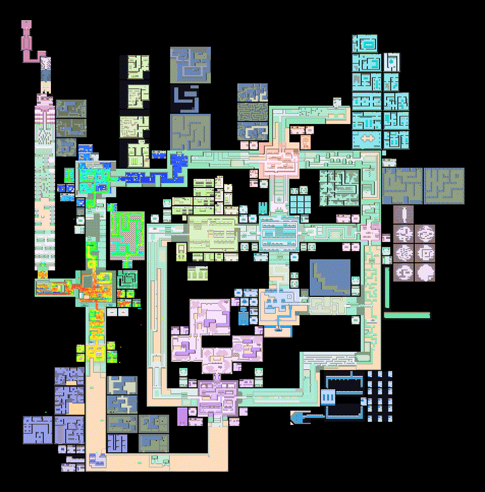

Hi! Since 2020, we've been developing a reinforcement learning (RL) agent to beat the 1996 game Pokémon Red.
As of February 2025, we are able to beat Pokémon Red with Reinforcement Learning using a ≈10 million parameter policy (60500x smaller than DeepSeekV3) and with minimal simplifications. This website acts as a journal describing the system's current state. [All code is open sourced and available for you, the reader, to try.](https://github.com/thatguy11325/Pokémonred_puffer).

<figcaption>A heatmap showing 288 agents progressing through Pokémon Red.</figcaption>

As improvements to the codebase is made, the changelog will be updated. Before you dive into the website,
lets provide some background on Pokémon and our motivation for using RL to beat it.

## Pokémon Red Primer

Pokémon Red, released in 1996, is a single player Japanese role playing game (JRPG) that follows the journey of a new "Pokémon Trainer." Players capture Pokémon "creatures" to battle against opposing Pokémon, 
explore the world and progress through the game’s storyline. Pokémon has two goals:

- Catch all possible Pokémon species.
- Become the "champion."

We focused on the second (more popular) goal, becoming the champion.

## Why Pokémon Red

Why care about developing an agent to beat Pokémon with machine learning? 
The answer is really a bit higher level. We believe solving _JRPGs_ with machine learning is a stepping stone towards AGI. JRPGs: 

- Involve complex reasoning and decision making.
- Are nonlinear.
- Can be long such as > 24 hours average human gameplay.
- Require multi-task reasoning.
- Have non-obvious reward functions.

Of JRPGs, Pokémon is relatively easy to program for. 
The [Pokémon Reverse Engineering Team](https://github.com/pret) (PRET) and the [PyBoy Python Gameboy Emulation](https://github.com/Baekalfen/PyBoy) projects have 
made it extremely easy to introspect the game and extract data as needed. Throughout this website, we'll show many examples of how we leveraged these tools for this work.

## Why Pokémon Red with RL
We could’ve taken many approaches if we wanted to beat Pokémon with machine learning.

- We could’ve chosen a supervised learning approach, but that would have needed a well 
labelled and plentiful dataset and honestly a model larger than we had the budget to support.

- We could’ve chosen a behavioral cloning approach and attempted to build a model that imitates a
known speedrun route. We tried that once, but struggled to make an performant data collection system.

- We could’ve attempted to beat the game with an LLM like like Pimanrules did 
in his video [Can ChatGPT play Pokémon Crystal? (with GPT-4V)](https://www.youtube.com/watch?v=Dct7dffObpY), but that would have
required a lot more money and computing power than we had at our disposal.

Of the many approaches considered, RL appealed to us the most.

What makes RL special is how you collect training data for an RL system. 
The data is almost always new data. No need to build 
complex data collection systems, manage large datasets or worry if the dataset is 
out of date. If you can build a system that can create new data on the fly, you can start training. 

With RL, we built an agent with minimal resources and achieved amazing results.

By [David Rubinstein](https://github.com/drubinstein), [Keelan Donovan](https://github.com/leanke), Daniel Addis, [Joseph Suarez](https://puffer.ai/), and [Peter Whidden](https://peterwhidden.webflow.io/)

With special thanks to:

- [Mads Ynddal](https://github.com/Baekalfen) - PyBoy
- Kyoung Whan Choe - Contributor and for collaboration in early 2024
- Death - Creator of the world map image asset.
- The PokeRL Discord Community
- The PufferAI Discord Community

## Changelog

### Feb. 28, 2025 - First Draft