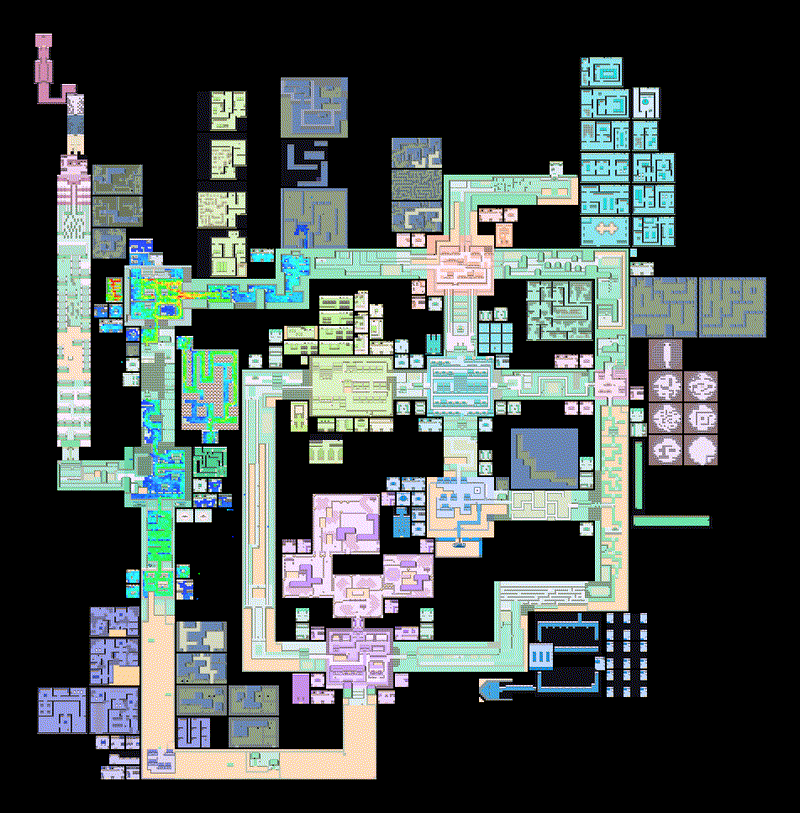

  <video width="100%" autoplay loop muted>
    <source src="assets/neonmapvid.mp4" type="video/mp4" />
  </video>

Hi! Since 2020, we've been developing a reinforcement learning (RL) agent to beat the 1996 game Pokémon Red.
**As of February 2025, we are able to beat Pokémon Red with Reinforcement Learning using a <10 million parameter policy (60500x smaller than DeepSeekV3) and with minimal simplifications.** The output is not a policy capable of beating Pokémon, but a technique for producing solutions to Pokémon. This website describes the system's current state. [All code is open sourced and available for you, the reader, to try](https://github.com/drubinstein/pokemonred_puffer) 
.

<video width="30%" autoplay loop muted>
  <source src="assets/coordscrop.mp4" type="video/mp4" />
</video>

As improvements to the codebase are made, the changelog will be updated.

## What is Pokémon Red?

Pokémon Red, released in 1996, is a single player Japanese role playing game (JRPG) that follows the journey of a new "Pokémon Trainer." Players capture Pokémon "creatures" to battle against opposing Pokémon, 
explore the world and progress through the game’s storyline. Pokémon has two goals:

- Catch all possible Pokémon species.
- Become the "champion."

We focused on the second (more popular) goal, becoming the champion.

## Why Pokémon Red

Why do we care about developing an agent to beat Pokémon with machine learning? 
The answer is really a bit higher level. We believe solving _JRPGs_ with reinforcement learning provide extremely difficult challenges not present in current RL environments. It is our hope that JRPGs will provide a great benchmark for improving AI.

- Can be just as complex as games like Go, StarCraft II or Minecraft.
- Involve complex reasoning and decision making.
- Are nonlinear.
- Can be long, with > 24 hours average human gameplay. Pokémon Red takes 25 hours on average for a new player to complete.
- Require multi-task reasoning.
- Have non-obvious reward functions.

Of JRPGs, Pokémon is relatively easy to program for. 
The [Pokémon Reverse Engineering Team](https://github.com/pret) (PRET) and the [PyBoy Python Gameboy Emulation](https://github.com/Baekalfen/PyBoy) projects have 
made it extremely easy to introspect the game and extract data as needed. Throughout this website, we'll show many examples of how we leveraged these tools for this work.

## Why Use RL
We could’ve taken many approaches if we wanted to beat Pokémon with machine learning.

- We could’ve chosen a supervised learning approach, but that would have needed a well 
labelled and plentiful dataset a model larger than we had the budget to support.

- We could’ve chosen a behavioral cloning approach and attempted to build a model that imitates a
known speedrun route. We tried that once, but struggled to make a performant data collection system.

- We could’ve attempted to beat the game with an LLM like like Pimanrules did 
in his video [Can ChatGPT play Pokémon Crystal? (with GPT-4V)](https://www.youtube.com/watch?v=Dct7dffObpY), but again, this would have required more money and computing power than we had at our disposal.

Of the many approaches considered, RL appealed to us the most.

What makes RL special is how you collect training data. 
The data is almost always fresh. No need to build 
complex data collection systems, manage large datasets or worry if the dataset is 
out of date. If you can build a system that can create new data on the fly, you can start training. 

With RL, we built an agent with a super tiny neural network with no pretraining (the agent starts by literally pressing random buttons!) and we still achieved amazing results.

Next Page

## Authors

[David Rubinstein](https://github.com/drubinstein), [Keelan Donovan](https://github.com/leanke), [Daniel Addis](https://github.com/xinpw8), Kyoung Whan Choe, [Joseph Suarez](https://puffer.ai/), [Peter Whidden](https://peterwhidden.webflow.io/)

## Acknowledgements

#### [Mads Ynddal](https://github.com/Baekalfen)
For creating PyBoy and his collaboration.

#### Death (PokeRL Discord handle)
For their countless hours making the world map asset.

#### [Tina Zhu](https://tolympia.github.io)

#### The [PokeRL Discord Community](http://discord.gg/RvadteZk4G)



Next Page

## Changelog

### March 4, 2025 - v1