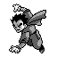
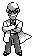
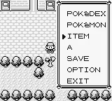
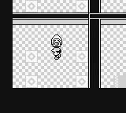
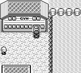

+++
title = 'The 8 Badges'
weight = 23
+++

# The 8 Badges

Next, I focused on what it takes to beat the 8 gym leaders. The gym leaders upon defeat, give the main character a “badge.” Badges either unlock the ability to use a taught field move or apply permanent stat modifiers to the agent’s party. Below is a table of the gym leaders of Pokemon, their types and what they unlock.

| **Gym Leader** | **Type** |                       **Reward**                       |
|:--------------:|:--------:|:------------------------------------------------------:|
| Brock           | Rock     | 
- 12.5% ATTACK boost - Can use FLASH outside of battle</align> |
| Misty           | Water    | 
- Can use CUT outside of battle</align>                        |
| **Lt. Surge**   | Electric | 
- 12.5% DEFENSE boost - Can use FLY outside of battle</align>  |
| **Erika**       | Grass    | 
- Can use STRENGTH outside of battle</align>                   |
| **Koga**        | Poison   | 
- 12.5% SPEED boost - Can use SURF outside of battle</align>   |
| **Sabrina**     | Psychic  |                                                        |
| **Blaine**      | Fire     | 
-12.5% SPECIAL</align> boost                                    |
| Giovanni        | Ground   |                                                        |

I emphasized 5 gym leaders. Why? Because these gym leaders can be accomplished in *nearly any order*. The vast majority of storyline events are gated by **Misty, Erika, and Koga** who give access to the field moves CUT, STRENGTH and SURF outside of battle. How to obtain these field moves will be discussed in a later section. 

Some gym leaders require solving puzzles or removing environmental guards.

## Lt. Surge's Gym Gimmick

To enter Lt. Surge’s gym you must remove a tree blocking the entrance to his gym with *Cut.*

Lt. Surge’s gym contains a button puzzle. To acquire the ability to battle Lt. Surge, you are given an array of trashcans. Two of the trashcans have a button that can be pressed. You must press the two buttons in a specific order. If you mess up, the buttons are randomly assigned to different trashcans.

## Erika's Gym Gimmick

To enter Erika's gym you must remove a tree blocking the entrance to her gym with cut. In her gym, she will be guarded by multiple trainers you must defeat *and* more trees to cut. Notably, the sprite for the trees within the gym are different from the tree sprite outside the gym.

## Koga's Gym Gimmick

Koga’s gym contains an easy maze made up of invisible barriers you have to traverse. 

## Sabrina's Gym Gimmick

Sabrina’s gym can only be entered after completing the Team Rocket storyline. Her gym contains a teleporter maze. To get to Sabrina, you must find the teleporter that will transport you to her. 

## Blaine's Gym Gimmick

To enter Blaine’s gym the agent must first *Surf* to Cinnabar Island where the gym is located. Subsequently, the agent must acquire the “SECRET KEY” from the Pokemon Mansion next door to his gym *Surf*. To battle Blaine, the agent must complete a series of optional True/False quizzes. If the agent incorrectly answers, the agent battles a trainer.

## Giovanni's Gym Gimmick

Giovanni’s gym is blocked until you beat all 7 prior gym leaders. Giovanni’s gym contains a maze puzzle with “spin tiles.”

The agent must be capable of solving all these tasks.