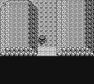
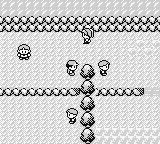
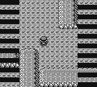
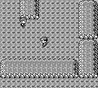
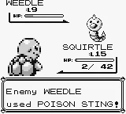

+++
title = 'Battling'
weight = 22
+++

# Battling

<figcaption>Various battle situations. From left to right: (a) Wild battle. (b) Trainer battle. (c) Running away from battle. (d) Catching a Pokémon. (e) Pokémon fainting and Player blacking out.</figcaption>

Half of the previously mentioned objectives involve battling and winning against other trainers. However, teaching battling *is not* required to make an agent capable of completing Pokémon with RL.

## The Battle System

The Pokémon battle system is pretty straight forward. Pokémon is an advanced game of rock-paper-scissors. Pokémon have moves that can be used to either inflict status effects against other Pokémon, damage other Pokémon or boost their own abilities or self-heal. The `STRENGTH` of each move is affected by the `STRENGTH`s and weaknesses of each Pokémon relative to the move and overall stats. Moves are given priority based on a Pokémon's ``SPEED`` stat or based on a move's priority. Damage is based on the Pokémon's ``ATTACK``, ``SPECIAL`` and ``DEFENSE`` stats depending on the move. Additionally, moves can miss based on a move and Pokémon's `ACCURACY` stats. 

There are two types of battles in Pokémon. The first is *wild* battles where the agent will battle against a single Pokémon. Wild battles begin with a random encounter in grassy areas or dungeons. The second type is *trainer* battles. Trainer battles place the player against a team of one or more Pokémon. Trainers have access to the item and party switch actions like the player.

During battles, the player can additionally switch their current Pokémon in-battle or use items to heal their Pokémon.

Battles end when all Pokémon on one side have fainted. Fainting is when a Pokémon's health drops to zero. Additionally, during a wild battle, the player has the option to *run* and leave the wild battle or *catch* the opposing Pokémon and have the opposing Pokémon join their party.

If the player's Pokémon knocks out the opposing Pokémon, the player's Pokémon gains experience (EXP). With enough EXP, a Pokémon will level up. Levelling up provides a mechanism to increase the Pokémon's stats. Levelling up to increase stats gives a mechanism to ignore worrying about battling. If the agent "grinds,” that is, let Pokémon level up or retry trainers infinite times, the agent will eventually win outside of a couple of very unlikely situations. 

Consequentially, I ignored creating a policy for battling and focused on providing suitable conditions for levelling up when needed.