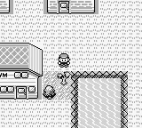
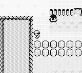

+++
title = 'Field Interactions and Exploration'
weight = 24
+++

# Field Interactions and Exploration

As mentioned previously, field moves taught to Pokémon via “HMs” allow you to interact with the world. These HMs can only be taught to specific Pokémon.

The 5 field moves of Pokémon are

- **HM01 - CUT**  
- HM02 - FLY  
- **HM03 - SURF**  
- **HM04 - STRENGTH**  
- HM05 - FLASH

Only CUT, SURF, and STRENGTH are required for game progression. Although useful, FLY and FLASH aren’t required. They only allow for faster game progression.

## Using an HM
*Teaching* and using an HM requires a minimum of 17 actions along with a Pokémon in the agent's party that is capable of learning the HM. 17+ actions are hard enough to give the agent context for. Incentivizing the agent to have HM capable party members when it is playing Pokémon for the first time without a guide is an even harder task!

## Obtaining HM01 - CUT

To acquire HM01, the agent must: 

- Acquire the SS Anne ticket from Bill north of Cerulean City. 
- Board the SS Anne and battle their rival
- Help the captain of the ship. 

The captain will reward the agent with the item HM01.

## Obtaining HM03 - SURF

To obtain SURF, the agent must reach the end of the Safari Zone in less than *500* steps. At the end, the Safari Zone Warden will reward the player with HM03

## Obtaining HM04 - Strength

To obtain STRENGTH, the agent must:

- Find the GOLD TEETH in the Safari Zone.
- Bring the GOLD TEETH to the old man NPC in Fuchsia City

The old man will then reward the agent with the item HM04

## Obtaining and Using the Pokéflute

Along with field moves, the agent will need to use the item Pokéflute for one field interaction. Pokéflute can remove two roadblocks (at least one is required) so the agent can gain access to Fuchsia City. 

However, using Pokéflute is very similar to using an HM. A level of convenience that I will use when ensuring the agent can perform the action.