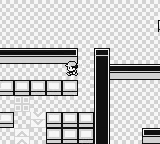
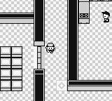

+++
title = 'Team Rocket'
weight = 25
+++

## Team Rocket Storyline

<figcaption>Various challenges when completing the Team Rocket storyline. From left to right: (a) A spin puzzle in Rocket Hideout. (b) Using warps to find the Lift Key in Silph Co. (c) Defeating Giovanni at Silph Co.</figcaption>

Pokémon contains mandatory quests involving the game's antagonists, Team Rocket. These events require defeating trainers, obtaining special items, and solving in-game puzzles. Thankfully, these quests must be accomplished in a linear order. For completeness, hare are all the tasks required to to complete the Rocket storyline:

- Defeat the Rockets blocking the exit to Mt. Moon (post Brock).
- Defeat the Rocket at the end of Nugget Bridge north of Cerulean City.
- Defeat the Rocket at the exit of Cerulean City.
- Defeat the Rocket guard in the Celadon City Casino.
- Press the poster switch the Celadon City Casino Rocket guard is guarding and enter the Rocket hideout.
- Solve the Rocket hideout maze puzzle on basement floor (BF) 3 to get to BF4.
- Beat the Rocket grunt in BF4.
- Pick up the dropped elevator key from the BF4 Rocket Grunt.
- Solve the maze puzzle on BF2.
- Use the elevator key to enter the elevator on BF2.
- Go to BF4 using the elevator key.
- Beat Giovanni in Rocket Hideout.
- Pick up the Silph Scope Giovanni drops.
- Save Mr. Fuji at the top of Lavender Tower  .
- Find the card key in Silph Co in Saffron City.
- Defeat Giovanni in Silph Co.

Unlike the gym leaders, the difficulty of the Team Rocket puzzles are highly variable, but brute-forceable. From these quests, we concluded the player needed a desire to either explore the whole world or spend extra time building a policy capable of reading and interpreting text. we decided to focus on the former.