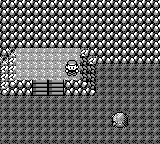
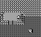

+++
title = 'Observations'
weight = 30
+++

# Observations

Observations are a representation of the state of the environment. For the Tic-Tac-Toe example, the observation was a 3x3 grid. For Minecraft, it could be a rendered frame and the player's current inventory.

 Pokémon is way more complex. Pokémon contains tons of visible and invisible pieces of information. Although the overworld gamescreen provides most information a player want, some important information can only be accessed by lengthy menu navigation, talking to NPCs and random exploration. For example, *no NPC* in the game explains to the player what a cuttable tree looks like. That is something the player has to discover.

It is possible to give the agent the entirety of in-game RAM and let the agent solve the game. We desired to make the agent play the game as a new *human* player would. When in doubt, we stuck to one rule when designing my observations:

_The observation can not contain any in-game knowledge a human player would not have access to._

What does this mean in practice? No knowledge of a Pokémon’s hidden stats. No knowledge of a Pokémon’s future moves. No knowledge of an enemy’s moveset. No knowledge of what a new area looked like until the agent visits the new area, etc. 

## The First Observations

 

<figcaption>Top: Full resolution screen. Bottom: What the agent observes. Even in a self-similar area like Mt. Moon, the agent can see where it has been.</figcaption>

### The current game screen downsampled by 2 (72x80 pixels) in grayscale.
- Pokémon Red was released as a grayscale game. Color does not provide any extra information until later generations.
- Downsampling the screen still provides enough information to determine where the character is.
- The screen gives the agent the most direct knowledge of what it is doing. 
- An alternative would be to collect all entity information for the current screen from RAM. However, we felt that the game screen provided the best parallel to how a human interacts with a Gameboy  
- Another alternative would be to provide the sprites as an observation. Again, we like how using pixels mimic how a human would experience Pokémon Red.

### The "Visited Mask"

- The Visited Mask is a view of the current game screen displaying where the player has *not* visited in its mini-episode.
- The visited mask provides a way of giving the agent its exploration history to the policy. Without the visited mask, the agent was more likely to revisit the same areas repeatedly and never progress  

### A binary vector of all events the agent has or has not completed.   
- Events are in-game objectives that have been accomplished. 
- Beating a gym is an event. Similarly, any trainer battles is an event. Even buying a ticket to the Pewter City museum is an event. 
- Pokémon uses an events array in the WRAM bank when to control what's loaded when entering a maps.
- We tried to not include the events array as the events observation leaks information.
- We had to create four "events" not included in the events array:
  - Rival 3 defeated.
  - Lapras acquired.
  - Drink given to Saffron guard.
  - Celadon Game Corner Rocket defeated.

## Handling New Challenges
Along the way, we added more observations to handle specific in-game complexity.

### The direction the agent is facing  
  
The direction provided an extra hint to teach the agent about what player sprite maps to what orientation.

### The map ID an agent will return to if they lose a battle (Blackout Map ID)
The blackout map ID may not be necessary, but the observation provides a way for help the agent understand to use Pokémon Centers (a form of checkpointing).

### The items in the agent’s inventory along with quantities  

Without an inventory observation, the agent would have to open the menu periodically to remember what it has. Additionally, some items are required. The inventory observation helps the agent know when it obtained a required, non-event item.

### The agent’s party including any information available in a party member’s stats page, e.g. health left  

The party observation may not have been necessary. We placed these observations in-case we ever wanted to write battle AI and to see if the agent learns anything about how different species and types are related to each other.

### The number of steps left in the Safari Zone minigame  

Although we have not explained the Safari Zone in-depth, we wanted to prevent the agent from walking aimlessly in the Safari Zone.

### Whether or not the agent has received the gift lapras.  

The Lapras observation is admittedly redundant given the party observation. However, Lapras is extremely important for game progression per [The Route]( "The Route").
