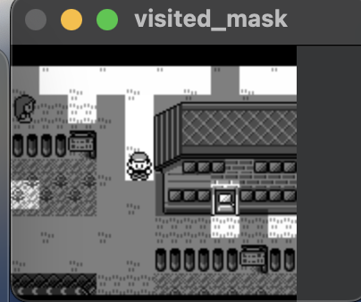

+++
title = 'Observations'
weight = 30
+++

# Observations

As mentioned previously, observations are a representation of the state of the environment. In the Tic-Tac-Toe example, the observation was a 3x3 grid. For Minecraft, it could be a screen image and the agent's current inventory. Pokemon contains tons of visible and invisible pieces of information.

It is possible to give the agent the entirety of in-game RAM and let the agent solve the game. I desired to make the agent play the game as a new player would. When in doubt, I tried to stick to one rule when designing my observations:

_The observation can not contain any in-game knowledge a human player would not have access to._

What does this mean in practice? No knowledge of a Pokemon’s hidden stats. No knowledge of a Pokemon’s future moves. No knowledge of an enemy’s moveset. No knowledge of the whole game map until a new area was visited. etc. 

## My First Observations

### The current game screen downsampled by 2 (72x80 pixels) in grayscale.
- Pokemon Red was released as a grayscale game. The color information does not provide any extra information until later generations.
- Downsampling the screen still provided enough information to determine where the character is.
- The screen gives the agent the most direct knowledge of what it is doing. 
- An alternative would be to collect all entity information for the current screen from RAM. However, I felt that the game screen provided the best parallel to how a human interacts with a Gameboy  
- Another alternative would be to provide the sprites as an observation. Again, I like how using pixels mimics how a human would play Pokemon Red.

### The "Visited Mask"

- The Visited Mask is a view of the current game screen displaying where the player has *not* visited in its mini-episode.
- The visited mask provides a way of giving the agent its exploration history to the policy. Without the visited mask, the agent was more likely to revisit the same areas repeatedly and never progress  

### A binary vector of all events the agent has or has not completed.   
- Events are in-game objectives that have been accomplished. In the GameBoy's WRAM, the events array tells the game what to enable/disable when the agent enters a new map.
- I tried as hard as possible to remove this. I want to eventually as believe the events observation leaks information.
- I had to create four events not automatically included in the events array:
  - Rival 3 defeated.
  - Lapras acquired.
  - Drink given to Saffron guard.
  - Celadon Game Corner Rocket defeated.

## Handling New Challenges
Along the way, I added more observations to handle specific in-game complexity.

### The direction the agent is facing  
- This provided an extra hint to teach the agent about what player sprite maps to what orientation.

### The map ID an agent will return to if they lose a battle (Blackout Map ID)
- This is not necessary, but was a way to help the agent understand to use Pokemon Centers, a form of checkpointing.

### The items in the agent’s inventory along with quantities  
- If the agent ever learned about what items it could use, this is how.   
- Some items are required. This observation helps the agent know when it obtained a required, non-event item  

### The agent’s party including any information available in a party member’s stats page, e.g. health left  
- This observation may not have been necessary, I placed these observations in-case I ever wanted to write battle AI.

### The number of steps left in the safari zone minigame  
- Although I have not explained the Safari Zone in-depth, I wanted to prevent the agent from running in circles in the Safari Zone.

### Whether or not the agent has received the gift lapras.  
- Although redundant given the party observation, Lapras is extremely important for game progression per "The Route."
