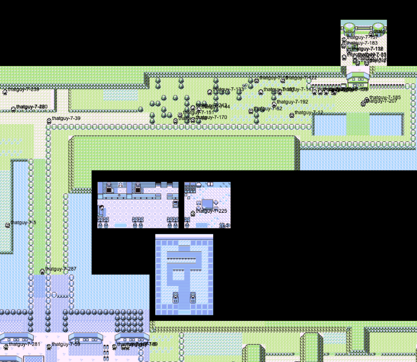
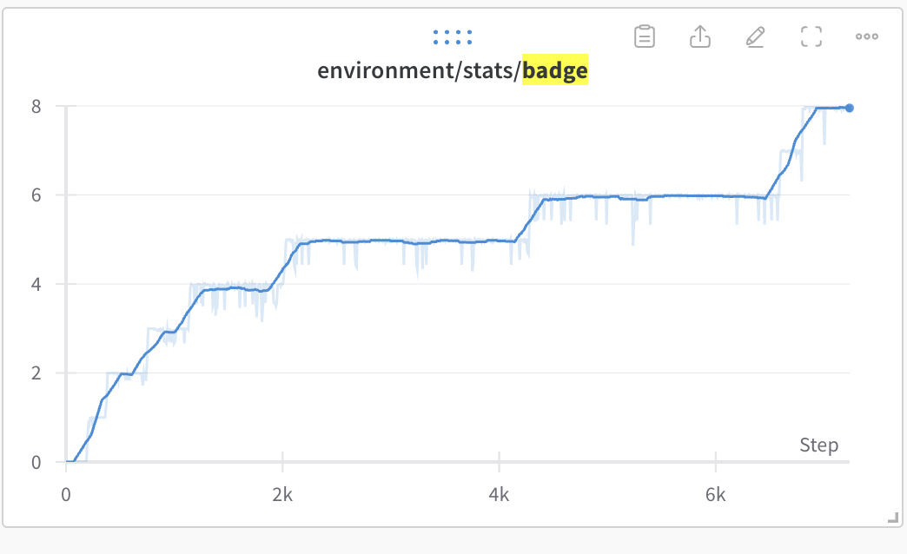
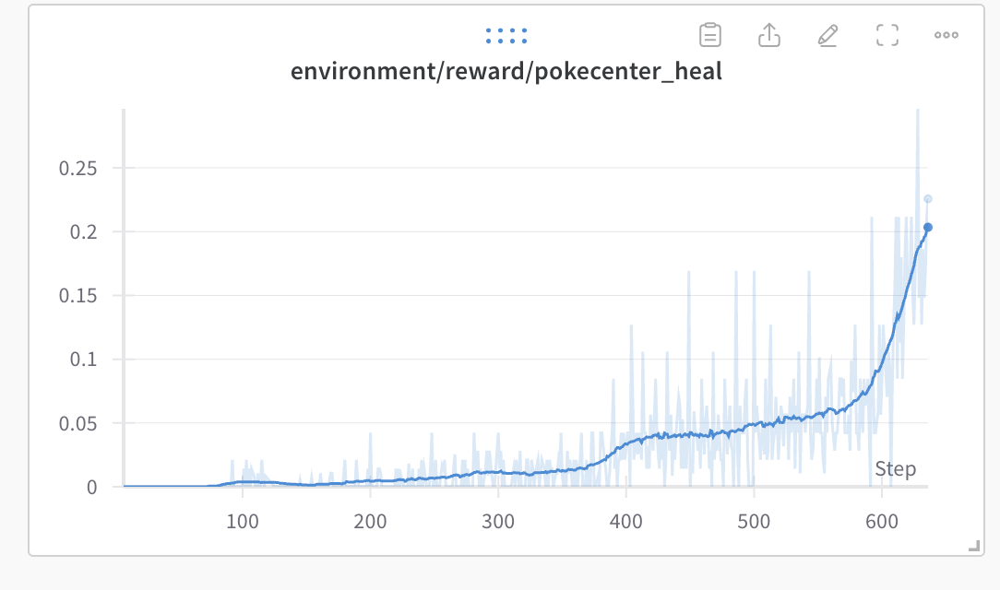
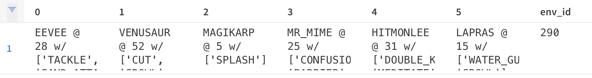
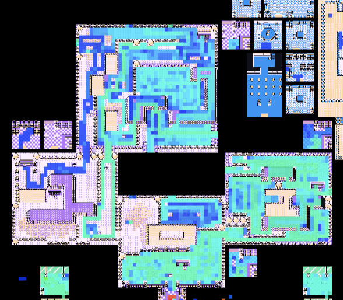
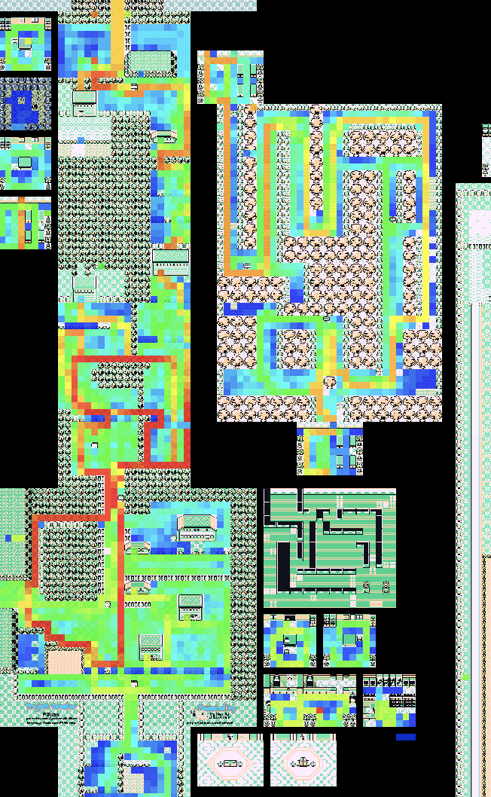
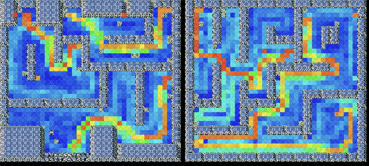

+++
title = 'Metrics and Visualization'
weight = 42
+++

# Metrics

Without metrics, I would have no way of knowing how far the agents have progressed. Inspecting the game play of 288 agents is not just time consuming, it's expensive. Videos consume valuable CPU and disk space to render. However, generating a few metrics are way smaller and easier and can provide data in _real time_.

For metrics writing, I had two sinks: [Weights and Biases](https://wandb.ai/) and [a live map visualization](https://pwhiddy.github.io/pokerl-map-viz/) Peter Whidden stood up for this effort. Without them, I wouldn't be able to make any logical improvements, I'd only be guessing.

## The Live Map

The live map is a really simple addition from the developer side. In a wrapper per agent, I open a websocket to a service Peter is hosting and I send the agent's coordinates over the websocket. I can leave it open during the day. I can check it out whenever. It also provided me a valuable way of seeing if new code I wrote (particularly sarming) was properly working. It was the first place I looked when evaluating a running experiment.

## Weights and Biases

### Charts

Charts provided an invaluable way for me to understand the timeline of progress and understand how fast the agent was capable of achieving tasks.

For example, I could look at a badge count metric to see how long it would take on average for an agent to get a badge. Fun fact, my current record for badge 1 is _10 minutes_

Or I could see how many events the agent has finished.

I could see if my pokecenter healing reward was finally tuned correctly.

And finally, I kept track of the current party all agents had. The party table provided me information I would only otherwise have by measuring gift Pokemon event completion. It also sometimes showed some fun scenarios.

For context, to get a Mr. Mime, the player must catch an Abra (extremely difficult to catch) and then perform an in-game train.

### The Map Overlay

Joseph Suarez at PufferAI also wrote a nifty heatmap of where the agent has visited during the experiment. I've made modifications since to show where the agent has visited during the episode. The map provided me a way of seeing where the agents were focusing effort when the live map was too hard to follow.

The heatmap showed some interesting behavior from the agents. For example, it clued me into how the agents would not focus on maximizing exploration in the Safari Zone, the agents' exploiting the hidden object reward (mostly through gambling), and the agents' preference to avoid battles (as a way to not lose exploration reward possibilities for a mini-episode). 

Sometimes the heatmap would also clue me into "routes" the agents' policy would collapse to. For example when I mis-weighted tree cutting rewards, the heatmap pointed out that the agents' would optimize for a route that would maximize their ability to cut trees in an episode.

The map could also show me more intelligent routing from the agents like when they found the optimal path through Rock Tunnel (wild battles were disabled for this run).

